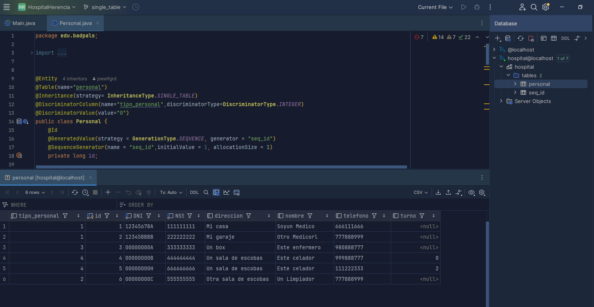
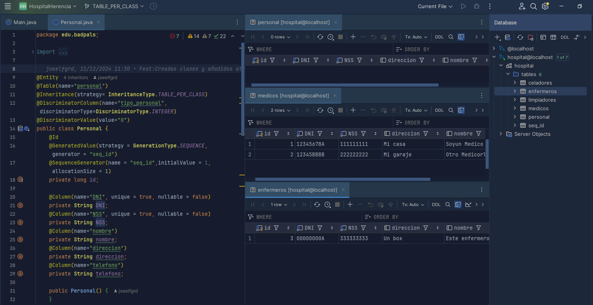
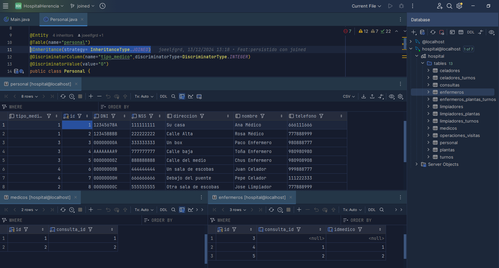

# Estrategias de Herencia en Hibernate

Este proyecto muestra los tres tipos de estrategias de herencia en Hibernate: `JOINED`, `SINGLE_TABLE` y `TABLE_PER_CLASS`. Cada estrategia se implementa en su propia rama y se prueba generando las correspondientes estructuras de tabla en MySQL. A continuación, se explican brevemente las estrategias, se muestran capturas justificativas para el supuesto de la BD de un hospital y se analiza cuál es la más eficiente en este caso concreto.

---

## 1. Estrategias

---

### 1.1. Estrategia `SINGLE_TABLE`
En la estrategia `SINGLE_TABLE`, toda la jerarquía se mapea a una única tabla. Se añade una columna discriminadora (`tipo_personal`) para diferenciar las subclases.

**Ventajas**:
- Estructura simple.
- Simplicidad en las consultas. Solo accedemos a una única tabla.

**Desventajas**:
- Ineficiente en el uso de almacenamiento: Las columnas específicas de subclases pueden estar llenas de valores nulos.
- Las relaciones complejas se pueden hacer más difíciles de manejar.

**Ejemplo de Tabla Generada**:
- `personal` (con una columna `tipo_personal` para identificar el tipo)
- Clase `Personal.java` con @Inheritance(strategy= InheritanceType.SINGLE_TABLE)

---

### 1.2. Estrategia `TABLE_PER_CLASS`
La estrategia `TABLE_PER_CLASS` genera una tabla separada para cada clase concreta en la jerarquía, incluyendo los atributos comunes de la superclase.

**Ventajas**:
- Las consultas directas a una subclase son rápidas, no hay necesidad de unir varias tablas.

**Desventajas**:
- Los atributos comunes se repiten en todas las tablas.

**Ejemplo de Tablas Generadas**:
- `medicos`, `enfermeros`, `limpiadores`, `celadores` (cada una con los atributos comunes de `personal`)
- Clase `Personal.java` con @Inheritance(strategy= InheritanceType.TABLE_PER_CLASS)

---

### 1.3. Estrategia `JOINED`
La estrategia `JOINED` mapea cada clase de la jerarquía a una tabla separada. La tabla de la superclase (`Personal`) contiene los atributos comunes, mientras que cada subclase tiene su propia tabla con los atributos específicos. Las relaciones se unen mediante claves foráneas.

**Ventajas**:
- No se repiten atributos comunes.
- Mejor para jerarquías complejas con muchas subclases.

**Desventajas**:
- Más costosa en términos de rendimiento, pues requiere unir varias tablas en consultas.

**Ejemplo de Tablas Generadas**:
- `personal` (superclase)
- `medico`, `enfermero`, `limpiador`, `celador` (subclases)
- Clase `Personal.java` con @Inheritance(strategy= InheritanceType.JOINED)

## 2. Justificación de la Mejor Estrategia

En este caso, la estrategia más eficiente probablemente sea la JOINED: 

- Evitamos la redundancia. Nos permite mantener los datos comunes de toda la jerarquía normalizados y centralizados en una única tabla, mientras que en las tablas de especialización solo tenemos los atributos específicos de las subentidades.
- Es más flexible para futuros cambios en la estructuras de datos. Si quisiesemos añadir nuevas especializaciones podemos encapsular de manera más sencilla los añadidos sin tener que modificar la tabla común. 
- Facilita hacer consultas a la jerarquía completa, pero manteniendo la consistencia de los datos en caso de necesitar consultas específicas a una o varias especializaciones.
- Facilita la escalabilidad en el caso de querer añadir más profundidad en las jerarquías (crear sub-subclases, p.ej.).

---

## 3. Autores

- Joel Figueirido [@joeelfgrd](https://github.com/joeelfgrd)
- Yelko Veiga [@yelkov](https://github.com/yelkov)